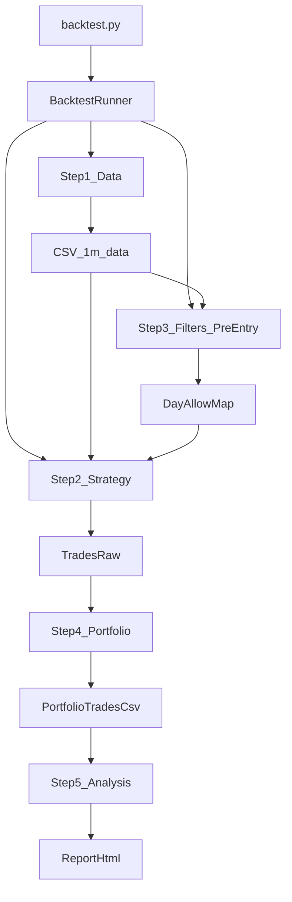

# Backtest Framework Migration Plan

## Phases (ordered)

### Phase_0_Architecture_and_folders

- **Goal**: Add a dedicated backtesting subsystem without polluting the existing live-signal bot (`main.py`, `src/scheduler.py`, `src/strategies/BaseStrategy`).
- **Decisions**:
- **Entry point**: root-level `backtest.py` (per requirement).
- **Backtest package**: introduce `src/backtest/` as the home for backtest-only engines, strategies, steps, and utilities.
- **Config**: add new backtest configs under `config/backtest/` to avoid conflicts with live `config/assets.yaml`.
- **Proposed structure**:
- [`backtest.py`](backtest.py)
- [`config/backtest/backtest.yaml`](config/backtest/backtest.yaml) (master config)
- [`src/backtest/runner.py`](src/backtest/runner.py) (orchestrates 5 blocks)
- [`src/backtest/contracts.py`](src/backtest/contracts.py) (interfaces + trade schema constants)
- [`src/backtest/data/`](src/backtest/data/) (historical data provider + downloader wrapper)
- [`src/backtest/steps/`](src/backtest/steps/) (Block/Step implementations)
- [`src/backtest/strategies/`](src/backtest/strategies/) (trade-generating strategies)
- [`src/backtest/filters/`](src/backtest/filters/) (pre-entry filter rules + pipeline)
- [`src/backtest/utils/`](src/backtest/utils/) (crypto day/ATR helpers, fee model)

### Phase_1_Backtest_contracts_and_trade_schema

- **Goal**: Make backtesting extensible by defining a trade-generation contract that is separate from live `BaseStrategy`.
- **Why**: Live `BaseStrategy.generate_signal(df)->dict|None` is a signal interface; backtests need `generate_trades(...)` and stable trade outputs.
- **Add**:
- `BaseBacktestStrategy` (trade-generation contract):
    - `generate_trades(minute_df, *, context) -> pd.DataFrame`
    - Must output a DataFrame with standard columns.
- **Standard trade schema** (minimum for portfolio blocks):
    - `symbol`, `strategy_id`
    - `entry_time`, `exit_time` (UTC)
    - `direction` (`long`/`short`)
    - `entry_price`, `exit_price`
    - `stop_level`, `tp_level` (nullable)
    - `raw_pnl`, `fees`, `net_pnl`
    - `exit_reason`
    - Optional metadata: `signal_time`, `timeframe`, `params_hash`
- **Files**:
- [`src/backtest/contracts.py`](src/backtest/contracts.py)

### Phase_2_Block1_data_layer_move_and_unification

- **Goal**: Keep Bybit downloading behavior “as is”, but relocate it behind a backtest data API.
- **Implementation**:
- Create `HistoricalDataProvider` interface:
    - `ensure_data(symbol, start, end, timeframe) -> Path|pd.DataFrame` (for now only 1m)
    - `load_1m(symbol) -> pd.DataFrame`
- Migrate `breakout/src/bybit_downloader.py` into [`src/backtest/data/bybit_downloader.py`](src/backtest/data/bybit_downloader.py) with import/path updates.
- Ensure 1m CSV format remains: `timestamp,open,high,low,close,volume,turnover`.
- **Config**:
- `config/backtest/backtest.yaml` block:
    - `data.source: bybit`
    - `data.symbols: [...]`
    - `data.start_date`, `data.end_date`
    - `data.raw_dir: data/raw/crypto`

### Phase_3_Common_timeframe_and_bar_building_utilities

- **Goal**: Enable 1h-indicator computations on top of 1m data (BBTrendline requirement).
- **Implementation**:
- Add resampling helpers (1m->1h OHLCV) with explicit UTC boundaries.
- Migrate needed crypto-day helpers from breakout utils into `src/backtest/utils/`:
    - 24h virtual day boundary logic (for ATR breakout)
    - ATR on 24h bars
- **Files**:
- [`src/backtest/utils/resample_utils.py`](src/backtest/utils/resample_utils.py)
- [`src/backtest/utils/crypto_day_utils.py`](src/backtest/utils/crypto_day_utils.py)

### Phase_4_Block2_strategy_split_ATR_breakout_levels_indicator_plus_breakout_strategy

- **Goal**: Split breakout engine into:
- **Indicator**: `AtrBreakoutLevels` (computes daily levels)
- **Backtest strategy**: `AtrBreakoutStrategy` (generates trades)
- **Indicator**:
- [`src/indicators/atr_breakout_levels.py`](src/indicators/atr_breakout_levels.py) (or `src/backtest/indicators/` if you prefer backtest-only)
- Inputs: daily bars + ATR series + multipliers
- Outputs: per-day `upper_level`, `lower_level`, `prev_close`, `prev_atr`
- **Strategy**:
- [`src/backtest/strategies/atr_breakout.py`](src/backtest/strategies/atr_breakout.py)
- Behavior should match current breakout engine:
    - 24h days start at configured `day_start_hour`
    - one breakout attempt per day
    - entry at breakout level (ideal)
    - stop based on ATR
    - EOD exit at day boundary close
    - fees using `fee_rate=0.003` round trip (from global backtest config)

### Phase_5_Block3_pre_entry_filters_as_Steps_with_rules

- **Goal**: Replace monolithic `TradeFilter` with SOLID filter rules + a pipeline, and make it reusable for backtest and live.
- **Design**:
- `BaseFilterRule` (single responsibility):
    - `prepare(minute_df, hourly_df, daily_df, context) -> Any` (optional cache)
    - `allow_entry(day_key, prepared, context) -> bool` (pre-entry decision)
    - `allow_live(now_context) -> bool` (future reuse)
- `FilterStep` / `FilterPipeline`:
    - reads enabled rules from config
    - applies AND/OR combination
    - produces:
    - a day-level allow/deny map (for pre-entry)
    - `isFiltered` column on trades for traceability
- **Migration**:
- Convert logic from `breakout/src/trade_filter.py` into:
    - [`src/backtest/filters/pipeline.py`](src/backtest/filters/pipeline.py)
    - [`src/backtest/filters/rules/*.py`](src/backtest/filters/rules/)
- **Initial rule to implement**:
- `LowTrueRangeFilter` (or `LowVolatilityPctFilter`) as the first concrete child.
- **Config**:
- `config/backtest/filters.yaml` referenced by `config/backtest/backtest.yaml`
- Includes `logic_mode: AND|OR` and per-rule params.

### Phase_6_BBTrendline_backtest_adapter_1h_signal_1m_execution

- **Goal**: Backtest existing Good Signal `BBTrendlineStrategy` without changing its live interface.
- **Approach**: Adapter that implements `BaseBacktestStrategy` and internally uses the live strategy for signal generation.
- **Implementation details**:
- Build 1h bars from 1m data.
- Compute BB on 1h bars using existing [`src/indicators/bollinger_bands.py`](src/indicators/bollinger_bands.py).
- Generate signals using existing [`src/strategies/bb_trendline.py`](src/strategies/bb_trendline.py).
- Map each signal time to **next 1m candle open**:
    - entry at that open
    - ignore further signals while in position
- Exit model (ideal fills):
    - stop level = `bb_middle` from the signal hour (fixed)
    - risk = `abs(entry - stop)`
    - tp = entry ± `4*risk` (RR 4:1)
    - per-minute simulation:
    - long: stop if `low<=stop`, tp if `high>=tp`
    - short: stop if `high>=stop`, tp if `low<=tp`
    - conflict in same candle: **stop_first** (configurable later)
    - fees: `fee_rate=0.003` round trip notional
- **Files**:
- [`src/backtest/strategies/bb_trendline_rr.py`](src/backtest/strategies/bb_trendline_rr.py)

### Phase_7_Block4_Block5_portfolio_builder_and_analysis_integration

- **Goal**: Keep portfolio builder/analysis logic “as is” but relocate it (or wrap it) so `backtest.py` can call it cleanly.
- **Strategy output compatibility**:
- Ensure each trade DataFrame matches the expected columns currently used by breakout `PortfolioBuilder` and `PortfolioAnalysis`.
- Add `strategy_id` column but do not require portfolio code to use it initially.
- **Implementation**:
- Option A (least change): move breakout portfolio modules into `src/backtest/portfolio/` and update imports.
- Option B (wrap): keep breakout modules in place but call them from a wrapper step with explicit paths.
- **Files**:
- [`src/backtest/steps/portfolio.py`](src/backtest/steps/portfolio.py)
- [`src/backtest/steps/analysis.py`](src/backtest/steps/analysis.py)

### Phase_8_backtest_py_runner_and_config

- **Goal**: `backtest.py` runs the 5 blocks with backtest configs in `config/` and supports multi-symbol + portfolio.
- **Runner behavior**:
- For each `strategy` configured:
    - For each `symbol` configured:
    - ensure/load 1m data
    - apply pre-entry filter step to derive allow/deny by day (strategy may opt into day-start semantics)
    - generate trades
    - write per-symbol trade CSV
    - concatenate trades across symbols
    - write combined trades CSV
    - run portfolio builder + analysis, producing a report per strategy
- **Files**:
- [`backtest.py`](backtest.py)
- [`src/backtest/runner.py`](src/backtest/runner.py)
- [`config/backtest/backtest.yaml`](config/backtest/backtest.yaml)

### Phase_9_tests_and_docs

- **Goal**: Keep regressions low and make the framework easy to extend.
- **Tests**:
- Unit tests:
    - ATR breakout levels indicator
    - BBTrendline adapter exit logic (stop/tp, stop-first conflict)
    - filter rule and pipeline logic
- Small integration test:
    - run backtest on a tiny fixture dataset and assert output columns + non-empty report path.
- **Docs**:
- Add a short backtest section in [`README.md`](README.md) and/or a new [`BACKTESTING.md`](BACKTESTING.md) with example configs and commands.

## Dataflow (5 blocks in Good Signal)

