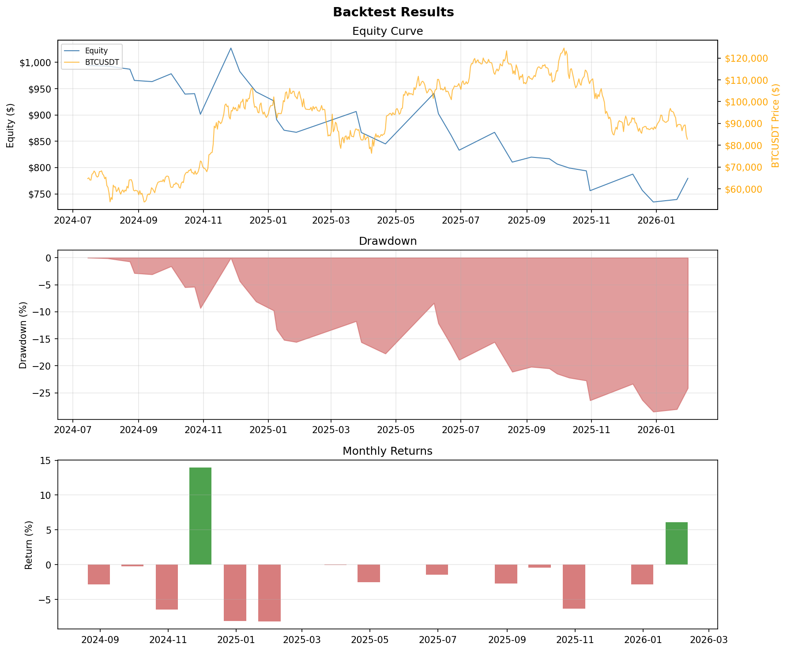

# Backtest Report — supertrend

| Metric | Value |
|--------|-------|
| Period | 2024-07-15 -> 2026-01-30 |
| Total Return | -22.05% |
| Annualized Return | -14.90% |
| | |
| Total Trades | 37 |
| Long / Short | 18 / 19 |
| Win Rate | 27.0% |
| Avg Win | $39.75 |
| Avg Loss | $-22.89 |
| Profit Factor | 0.64 |
| | |
| Max Drawdown | -28.49% |
| Avg Drawdown | -14.70% |
| Sharpe Ratio | -0.84 |
| Sortino Ratio | -0.57 |
| | |
| Initial Capital | $1,000.00 |
| Final Equity | $779.54 |

## Charts

